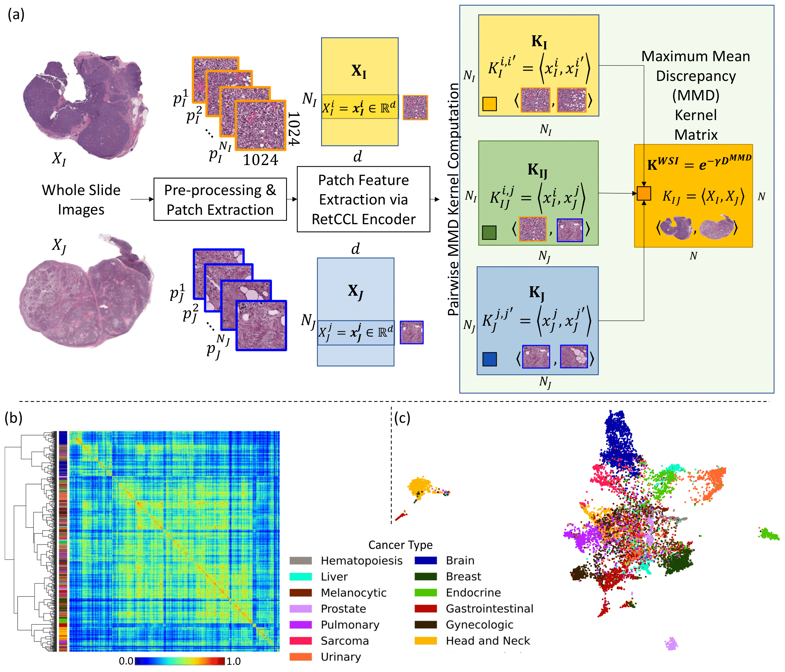

# HistoKernel: Whole Slide Image Level Maximum Mean Discrepancy Kernels for Pan-Cancer Predictive Modelling

### Piotr Keller*, Muhammad Dawood and Fayyaz ul Amir Afsar Minhas
### Tissue Image Analytics Center, University of Warwick, United Kingdom

This repository contains the code for the following manuscript:

HistoKernel: Whole Slide Image Level Maximum Mean Discrepancy Kernels for Pan-Cancer Predictive Modellings, submitted to Nature Machine Intelligence for review.

## Introduction
Computational Pathology (CPath) uses multi-gigapixel Whole Slide Images (WSIs) for various clinical tasks. However, due to the size of these images current methods are forced to make patch-level predictions which are then aggregated into WSI-level predictions. This work proposes a novel solution to the aggregation problem. By utilizing Maximum Mean Discrepancy (MMD) to measure similarity between WSIs we generate a WSI-level similarity kernel that kernel-based approaches can leverage. We perform a comprehensive analysis of this novel approach by performing WSI retrieval (n = 9,362), drug sensitivity regression (n = 551), point mutation classification (n = 3,419), survival analysis (n = 2,291) and multi-modal learning (n=956), outperforming existing methods. We also propose a novel perturbation based method to provide patch-level explainability of our model. This work opens up avenues for further exploration of WSI-level predictive modelling with kernel-based methods.

## Dependencies
scipy

numpy

matplotlib

geomloss

pandas

torch

sksurv

lifelines

sklearn

seaborn

tqdm

## Usage
### Step 1. Data download
Download the FFPE whole slide images from GDC portal (https://portal.gdc.cancer.gov/).

Download corresponding gene point mutation and Disease Specific Survival from cBioPortal (https://www.cbioportal.org/).

Download drug sensitivity scores for breast cancer patients (https://github.com/engrodawood/HiDS).

Download patient topic data (https://github.com/engrodawood/HiGGsXplore).
### Step 2. Data processing
For each WSI perform:

- Tile extraction: extract 1024x1024 tiles from the large WSI at a spatial resolution of 0.50 microns-per-pixel
- Patches capturing less that 40% of informative tissue are discarded (mean pixel intensity above 200)
- Feature extraction: extract a feature vector for each tile using [`RetCCL`](https://github.com/Xiyue-Wang/RetCCL)

Details can be found in the paper.
### Step 3. MMD Kernel generation for 2048-dimensional feature representations of 12,186 TCGA slides 

Using the code under [`MMD_distance_matrix_generator`](https://github.com/pkeller00/Anubis/tree/main/MMD_distance_matrix_generator) to generate an $N \times N$ distance matrix using MMD where $N$ is the number of WSIs in a dataset.

Details can be found in the paper and [MMD_distance_matrix_generator](https://github.com/pkeller00/Anubis/tree/main/MMD_distance_matrix_generator).

### Step 4. Downstream Analysis
To perfrom the downstream tasks (point mutation prediction, [`Drug Sensitivty prediction`](https://github.com/pkeller00/Anubis/tree/main/DrugSensitivity), [`Survival Analysis`](https://github.com/pkeller00/Anubis/tree/main/SurvivalAnalysis), [`WSI Retrival`](https://github.com/pkeller00/Anubis/tree/main/WSIRetrival) and Multi-Modal Learning) mentioned in the paper  navigate to the appropraite folder in this GitHub.

## Note

Some intermediate data are put into the folder [`data`](https://github.com/pkeller00/Anubis/tree/main/data).

--------

\* first author
